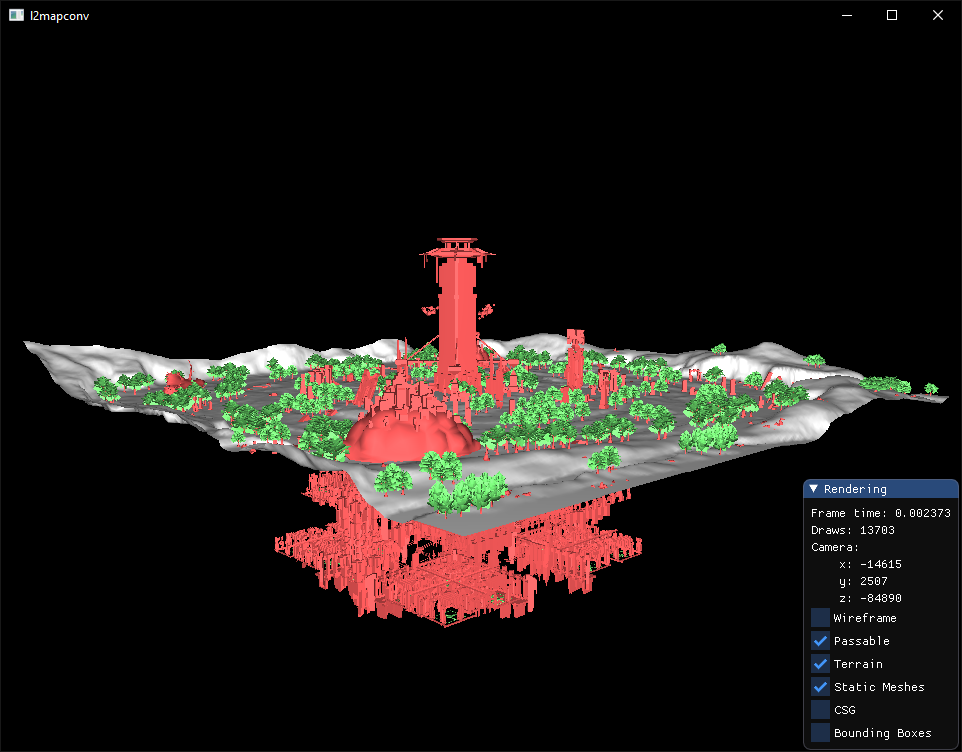
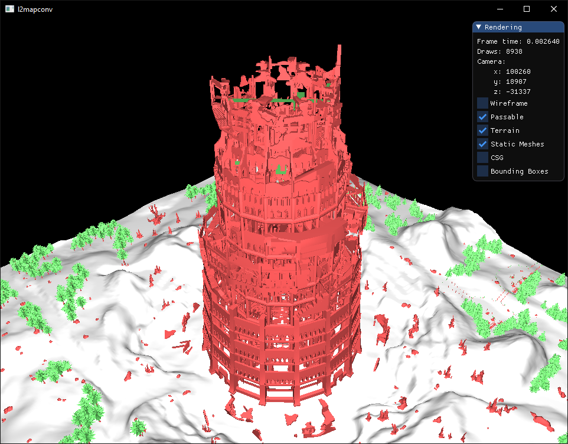
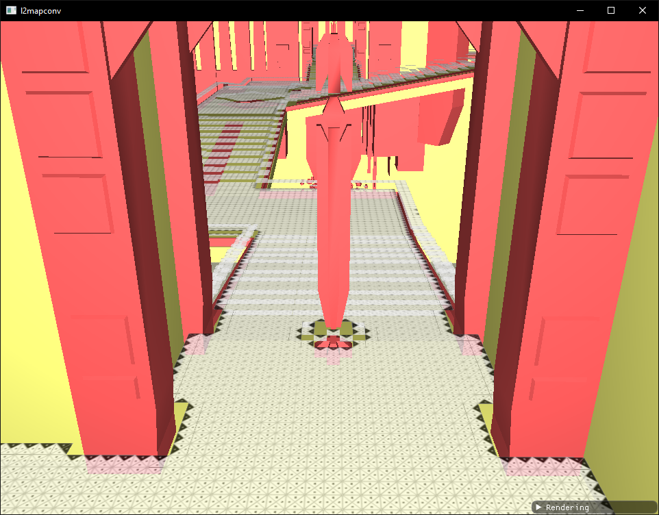
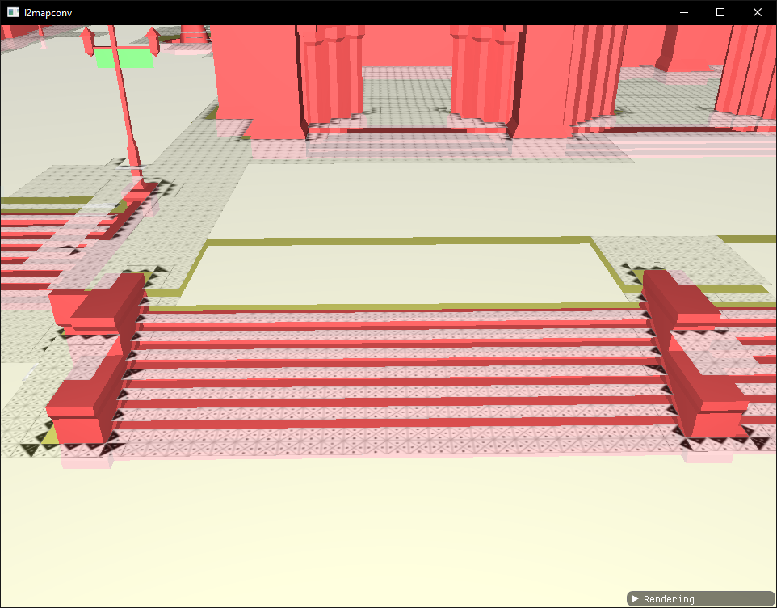

# l2mapconv

<p align="center">
    
    
    
    
</p>

L2 geodata generator... someday.

Tested with clients:

- C1
- HF

## Features

- L2J geodata preview

## Todo

- [ ] Blocking volumes import
- [ ] Geodata generation

## Usage

1. *Optional*. Place L2J geodata files in the `geodata` directory.
2. Run `l2mapconv` providing path to the client and map names:

```bash
> l2mapconv.exe "C:/Path/To/L2" 19_21 20_21
```
3. Use WASD, right mouse button and Shift to control camera and speed.

## Building

Tested on environment:

- Windows 10
- MVS 2019
- Clang 10
- Cmake 3.17
- Ninja 1.10

```bash
> git clone git@github.com:madyanov/l2mapconv-public.git
> cd l2mapconv-public
> cmake -H. -G Ninja -Bbuild -DCMAKE_BUILD_TYPE=Release -DCMAKE_C_COMPILER="C:/Program Files/LLVM/bin/clang.exe" -DCMAKE_CXX_COMPILER="C:/Program Files/LLVM/bin/clang.exe"
> cd build
> ninja
```

## Credits

- [L2PackageTools](https://github.com/Bigcheese/L2PackageTools)
- [l2mapper](https://github.com/justgos/l2mapper)
- [UEViewer](https://github.com/gildor2/UEViewer)
- UE 2004
