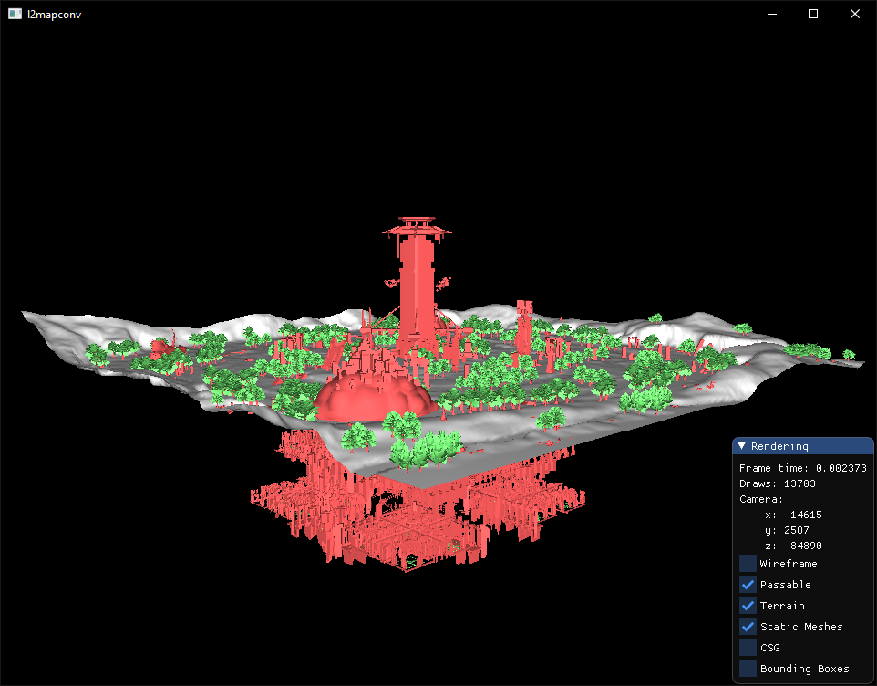
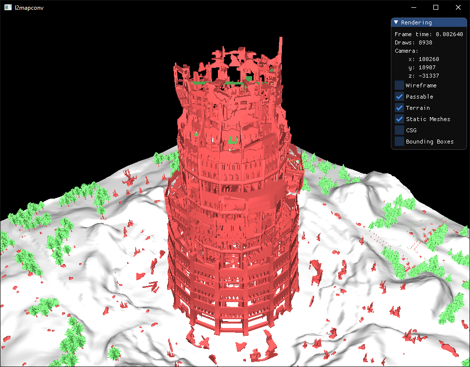

# l2mapconv

<p align="center">
    
    
</p>

Lineage II map previewer and geodata builder.

- Supported geodata generation clients: C1, HF.
- Supported geodata export formats: L2J and PTS (`XX_YY_conv.dat`).
- Experimental map preview: Essence P542, verified with Samurai Crow EU maps,
  including dynamic streaming around `22_22`.

## Features

- Map and geodata preview with a discoverable map catalog.
- Collisionless six-axis free camera with geometry filters.
- Manual terrain selection plus automatic full-detail streaming for the current
  map and, optionally, its immediate neighbours.
- L2J and PTS geodata building from the same generated map data.

## Usage

Double-click `l2mapconv.exe` to reopen the most recent valid client. On first
launch, choose the client's `sam` directory. Desktop settings are stored under
`%LOCALAPPDATA%\l2mapconv\settings.ini`; the client remains read-only.

The `Client` window shows the active client root, a `Browse...` button, and up
to ten recent client roots (newest first). Choosing a different root validates
its map catalog, shuts the current loading/rendering session down cleanly, and
then starts a fresh session. Desktop startup prefers `22_22` and otherwise
opens the first sorted numeric map available in `Maps`.

Command-line preview and build invocations remain available. In particular,
`--build` never opens a folder picker and does not change the recent-client
history.

```sh
l2mapconv.exe --preview/build --client-root <path> -- [maps...]

    --preview          Preview maps
    --build            Build maps (writes `.l2j` and `_conv.dat` to `output`)
    --client-root arg  Path to the Lineage II client
    --log-level arg    Log level (0 - none, 1 - fatal, 2 - error, 3 -
                       warn, 4 - info, 5 - debug, 6 - all) (default: 3)
    --help             Print help
```

> Use `--log-level 4` option to print building progress.

## P542 map preview

The geometry-only profile has been verified locally with `22_22` from the
Lineage II Essence Samurai Crow EU P542 client:

```powershell
.\build\preview-core\install\l2mapconv.exe --preview --log-level 4 --client-root "D:\line\clients\Lineage II - Essence - Samurai Crow - EU-P542\sam" -- 22_22
```

Controls:

- Hold right mouse button and move the mouse to look around.
- `WASD` moves horizontally.
- `Space` and `Left Ctrl` move vertically.
- `Left Shift` accelerates and `Left Alt` slows movement.
- `M` toggles wireframe rendering.
- The Maps window lists every numeric `Maps/*.unr` region found in the client.
  Individual checkboxes pin terrain-only regions; `Select All` and
  `Clear Manual` make whole-world terrain inspection practical without loading
  every static mesh. Each cell suffix reports its state: `-` unloaded,
  `Q` queued, `L` loading, `T` terrain resident, `D` detail resident, and
  `!` failed.
- The Rendering window shows the map under the camera and controls automatic
  full-detail loading for the current map. `Include +1 neighbors` independently
  enables or disables the surrounding 3x3 detail neighbourhood. It also shows
  world coordinates, camera speed, mouse sensitivity, and independent
  visibility switches for terrain, static meshes, CSG, and Blocking Volumes.
- The Maps summary reports manual selections, terrain/detail residents, and
  queued/loading/failed work while the background loader keeps the viewer
  responsive.

For a first whole-world pass, use the texture-disabled `preview-core` build,
press `Select All`, and leave automatic current-map loading enabled. All
selected maps are then kept as terrain-only geometry while the current map (and
the optional `+1` ring) retains full detail. The texture-enabled profile remains
useful for targeted smoke tests, but is not the recommended way to load the
whole world.

Preview treats the client as read-only input. Debug logging does not dump
decrypted packages, and automatic ImGui settings persistence is disabled so
the current working directory is not modified. The log reports actor, vertex,
and triangle counts for terrain, static meshes, CSG, and Blocking Volumes.
Unsupported or missing P542 texture references are logged and fall back to
surface colors; use the geometry-only profile when inspecting collision
geometry.

The Geodata `Reset` and `Build` buttons are disabled in streamed preview mode:
the visible scene may contain terrain-only regions and is not a complete
generation input. The command-line `--build` workflow is unchanged and remains
the only complete-map generation path.

P542 geodata export has passed structural file checks, but heights and
passability have not yet been validated in a live client/server. The current
P542 scope is map inspection, not a claim that generated geodata is ready for
a live server.
Both formats contain the same generated cells; the PTS export is written
directly from the build buffer, not by reading the L2J file. Inspect both
files and test heights and passability in the client/server before deployment.
The `output` directory is created automatically. Existing region outputs are
never overwritten: run from a fresh working directory or move the old files
aside before rebuilding a region.
Builds reject more than 64 layers per column and heights that cannot be
represented by the output format. Complex/multilayer heights must fit
`[-16384, 16376]` after quantization; flat blocks retain raw signed 16-bit
heights. A failed region export publishes neither file, and `--build` reports
the error with a nonzero exit code. Earlier completed regions remain intact.
Texture-complete interactive preview remains separate from the territory
exporter below. Neither path claims exact retail shader parity.

## Territory / radar rendering (Windows 10+)

The ready build is `build/territory-render/install/l2mapconv.exe`. Keep its
installed resource directory alongside the executable. No installation into
the Lineage II client is needed. Territory rendering works even when the
interactive viewer was built with `L2MAPCONV_LOAD_TEXTURES=OFF`.

In the viewer, mark squares in **Maps**, then use **Territory Render**:

- Choose **4K / 8K / 16K** (4096 / 8192 / 16384 pixels, default 8K).
- Choose an output folder outside the client; toggle supported water surfaces.
- **Render selected** exports the manually checked maps, one at a time, with
  full visual geometry regardless of preview residency or visibility settings.
- **Inspect textures** checks references/material support without a GPU render.
- Progress, issues, **Cancel**, and **Open output folder** belong to this job.
  Changing map checkboxes does not change an active job. Client switching is
  disabled until the job finishes. Closing the viewer terminates its own worker.

The same backend is available to scripts and agents:

```powershell
.\l2mapconv.exe --render-territory --client-root 'D:\clients\sam' --output 'D:\radar' --resolution 8192 -- 22_22
.\l2mapconv.exe --render-territory --client-root 'D:\clients\sam' --output 'D:\radar' --resolution 16384 --no-water -- 22_22 24_18
.\l2mapconv.exe --inspect-territory --client-root 'D:\clients\sam' --output 'D:\radar-audit' -- 22_22
```

New public commands emit exactly one JSON result to stdout; diagnostics go to
stderr. Exit codes: **0** completed (possibly with warnings), **2** invalid
input/startup, **3** execution failure, **130** cancellation. Inspect rejects
render-only options. `--preview` and `--build` retain their existing behavior.
The internal `--render-job <absolute-directory>` route is for owned UI workers,
not an alternative public command-line syntax.

Each run creates a new `render-<unique-id>` directory; outputs never overwrite
an earlier run or client data. It contains immutable `request.json`, atomic
`status.json`, a final `report.json`, per-map report checkpoints and, for
completed rendered maps, `<map>_<resolution>.png`. UI workers also write
`worker.log`. The result's `files` array lists both images and JSON reports;
filter by `.png` when collecting images. `schema_version` is currently 1.
Reports distinguish missing packages/objects, unsupported/corrupt data and
explicit simplifications, and record primary map SHA-256, bounds, density,
resolution, GPU, water evidence and processed/unprocessed maps. The hash is of
the primary `.unr`, **not** a complete texture-package manifest.

Each map's `material_inventory` includes successful and non-textured materials,
their class/reference chains, resolved node graphs and render states, referring
surfaces, and texture identities/dimensions/encodings/color-space usages. Equal
material variants are deduplicated; `library_ids` preserves their scene aliases.
Texture IDs in graphs refer to the same map's texture inventory. Referenced but
omitted effects are marked `not_evaluated`, not claimed as loaded. Per-map
checkpoints contain only that map; `report.json` aggregates the job.
On GPUs with fewer available texture slots, over-limit materials use an
explicitly reported neutral fallback. Ordinary materials do not reserve a
terrain-mask slot. Inspect reports asset support without initializing a GPU;
hardware-specific fallbacks are added by rendering.

Images are lossless RGB8 PNG with sRGB metadata, tiled native-resolution
rasterization, linear-light blending, mip filtering and up to 4x MSAA.
North is at the top (-Y). Tile rendering bounds memory instead of creating a
single 16K GPU framebuffer. Finished files survive later-map failure/cancel;
an unfinished PNG is not published. Force-terminated jobs may retain temporary
files in their own job directory; those are not finished results.

Verified on Samurai Crow P542 `22_22`: 4K, 8K and 16K outputs decode at their
exact native sizes. The material loader supports highest mips, P8/RGBA8/L8 and
DXT1/3/5, supported Shader/FinalBlend/Combiner graphs, opacity, actor skin slots
and the evidenced regular-grid terrain projection. Unsupported graph branches
are diagnosed rather than silently replaced with unrelated textures.

Known visual limits:

- The tested client's `T_texture.Texture.g_01` is referenced as `G_01` by the
  map. Import lookup ignores ASCII case while retaining package/group/class
  identity, so this terrain layer uses the real texture. Earlier exports with
  pale fallback patches must be regenerated; the client package needs no edit.
- Water on `22_22` uses 109 actual horizontal BSP surfaces with the verified
  `FX_E_T.WaterSurfaceShaderSet.WaterShader01` material, cross-checked against
  physical water volumes. Volume bounds themselves are not drawn. Other water
  profiles are not automatically inferred from names.
- Lighting is a neutral approximation; retail lightmaps/fog, dynamic water
  reflection/refraction/waves, some animated/material effects and unusual
  terrain projections remain simplified or unsupported. Fixed-time modifiers
  use time zero; unsupported oscillators preserve their base coordinates.
- Intersecting transparent geometry uses approximate draw ordering. This is
  a map export tool, not a pixel-identical recreation of the client renderer.

## Project building

Requirements:

- Clang/GCC
- CMake
- Ninja or other build system
- Git to apply the [Recast patch](libs/patches/recast.patch)

### Windows

```powershell
git clone --recurse-submodules -j8 https://github.com/m49n/l2mapconv-public.git
cd l2mapconv-public

cmake -S . -B build/preview-core -G Ninja -D CMAKE_BUILD_TYPE=Release -D L2MAPCONV_LOAD_TEXTURES=OFF -D CMAKE_C_COMPILER="C:/Program Files/LLVM/bin/clang.exe" -D CMAKE_CXX_COMPILER="C:/Program Files/LLVM/bin/clang++.exe"
cmake --build build/preview-core --parallel

cmake -S . -B build/preview-textured -G Ninja -D CMAKE_BUILD_TYPE=Release -D L2MAPCONV_LOAD_TEXTURES=ON -D CMAKE_C_COMPILER="C:/Program Files/LLVM/bin/clang.exe" -D CMAKE_CXX_COMPILER="C:/Program Files/LLVM/bin/clang++.exe"
cmake --build build/preview-textured --parallel

cmake -S . -B build/territory-render -G Ninja -D CMAKE_BUILD_TYPE=Release -D L2MAPCONV_LOAD_TEXTURES=OFF -D CMAKE_C_COMPILER="C:/Program Files/LLVM/bin/clang.exe" -D CMAKE_CXX_COMPILER="C:/Program Files/LLVM/bin/clang++.exe"
cmake --build build/territory-render --parallel
```

### macOS/Linux

```sh
git clone --recurse-submodules -j8 git@github.com:madyanov/l2mapconv-public.git
cd l2mapconv-public
CC=clang CXX=clang++ cmake -S . -B build -G Ninja -D CMAKE_BUILD_TYPE=Release
cmake --build build --parallel
```

### CMake Options

- `L2MAPCONV_GEODATA_POST_PROCESSING` — enable geodata compression and cell alignment. Disable to see actual cell positions during development.
- `L2MAPCONV_LOAD_TERRAIN` — disable for faster geodata building during development.
- `L2MAPCONV_LOAD_TEXTURES` — loads textures for supported static meshes and
  BSP surfaces. Keep a separate texture-disabled build as the reliable
  geometry inspection profile.

### Tests

Build `l2mapconv_tests`, then run `ctest --test-dir build/preview-core
--output-on-failure`. The portable tests cover NSWE landing surfaces, layer
capacity, height encoding, and export failure cleanup without client assets.

To additionally check real actor collisions and build-error diagnostics, set
`L2MAPCONV_TEST_CLIENT_ROOT` to a local Samurai Crow EU P542 `sam` directory
when configuring CMake. Build both `l2mapconv` and `l2mapconv_tests` before
running CTest. These optional fixtures require `24_18` and `25_19`; the latter
must contain meshes shared by actors with different collision policies.
Client assets are read-only and are not distributed with the tests.

Territory CPU/controller/CLI tests run under the same CTest suite. Real GPU
checks are opt-in. `territory_png_compare <image> [second-image]` independently
decodes PNGs using stb and prints JSON dimensions, channel statistics and
optional pixel deltas. For all three resolutions, water on/off, synthetic
tiled/color fixtures and L2J regression against a known baseline:

```powershell
.\tests\territory\Acceptance.ps1 -App 'D:\repo\build\territory-render\install\l2mapconv.exe' -Client 'D:\clients\sam' -Output 'D:\new-acceptance-run' -BaselineGeo 'D:\baseline\output'
```

Use a new output directory; `-SkipGeo` runs only the rendering checks. The
script's resolved `G_01` texture assertion targets the tested P542 client. UI
interaction and client-asset identity checks are separate from this script.

## Dependencies

- [recast](https://github.com/recastnavigation/recastnavigation)
- [cxxopts](https://github.com/jarro2783/cxxopts)
- [glew](https://github.com/Perlmint/glew-cmake)
- [glfw](https://github.com/glfw/glfw)
- [glm](https://github.com/g-truc/glm)
- [imgui](https://github.com/ocornut/imgui)
- [stb](https://github.com/nothings/stb)

## Credits

See [CREDITS.md](CREDITS.md) for project authors, preserved fork contributors,
dependencies, and the external references used during P542 compatibility work.
