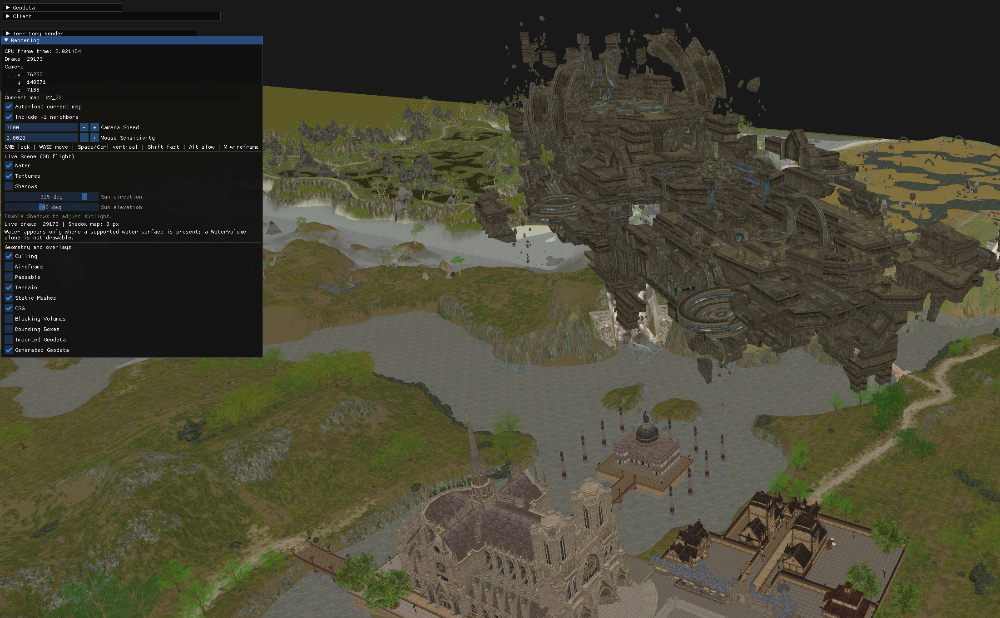
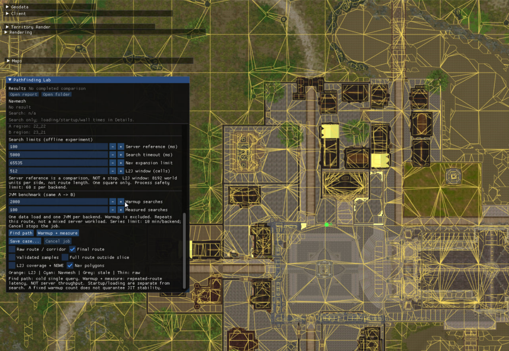
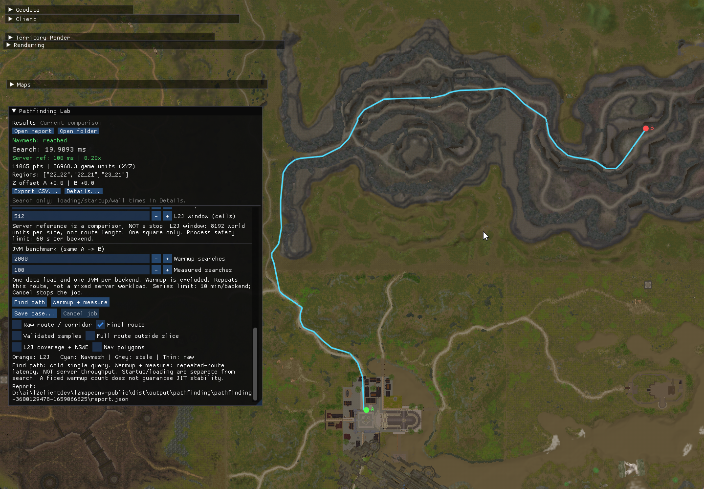

# l2mapconv-public

<p align="center">
    
    
</p>

Lineage II map previewer, geodata generator and high-resolution map/radar renderer.

- Working geodata generation for C1, HF and Essence P542 clients.
- Geodata export formats: server L2J (`XX_YY.l2j`) and client PTS (`XX_YY_conv.dat`).
- **Navmesh generation is experimental / in testing:** tiled Recast/Detour
  output (`XX_YY.navmesh`), independently selectable alongside L2J and verified
  offline with Java recast4j. Server integration and movement parity are not
  verified; it is not a drop-in replacement for server geodata.
- **Pathfinding Lab** for offline L2J/Navmesh route testing: pick A/B with the
  mouse, inspect the final route, compare search timings and run JVM warmup
  with repeated measurements.
- Map/radar rendering at **1K / 2K / 4K / 8K / 16K**, with textures, supported
  water surfaces and optional shadows.
- Tested on **Lineage II Essence — Samurai Crow EU P542 (build 542)**:
  geodata generation, map preview and map/radar rendering. The viewer supports
  dynamic streaming and live materials, including `22_22` and `23_18`.

## Features

- Map and geodata preview with a discoverable map catalog.
- Collisionless six-axis free camera with geometry filters.
- Manual terrain selection plus automatic full-detail streaming for the current
  map and, optionally, its immediate neighbours.
- Live P542 detail with supported textures, water surfaces and adjustable
  geometry-based shadows; radar/PNG export has separate controls.
- High-resolution territory/radar PNG export from 1024 to 16384 pixels, with
  independent texture, water and shadow controls in the UI and CLI.
- L2J and PTS geodata building from the same generated map data.
- Optional Pathfinding Lab with a north-up view, cell/polygon overlays,
  mouse-selected endpoints and explicit floor choice where ambiguous. Query
  L2J, Navmesh or both loaded formats; inspect highlighted results, export
  final game XYZ routes and save cases for CLI replay.
- Arrow buttons beside map cells move to the clicked square without changing
  checkboxes or automatic streaming settings.

## Usage

The single ready-to-run package is `dist/`. Start **`dist/l2mapconv.exe`** for
map preview, geodata tools and territory/radar rendering. Keep its `shaders`
and `textures` folders alongside it. Keep the prepared `pathfinding-backend`
folder beside the EXE: Lab and CLI connect it automatically, without selecting
a JSON profile. It contains a local Java runtime and offline backend snapshot,
not a running server. Manual profiles remain under advanced Lab settings.
The public Windows ZIP includes **only the Navmesh backend** and its Java
runtime. L2J/PTS generation and L2J overlays are still available; L2J route
queries require a separately prepared compatible offline backend/profile.
Server binaries, configuration, private integration tools and generated data
are not included in the public package.
Test executables stay under `build/`;
there are no separate VSync, mouse-test or radar applications to choose from.
Raw mouse input (when supported) and VSync are enabled in the main viewer.
The window title and `l2mapconv.exe --version` show the source commit and
preview profile. `-dirty` means tracked sources or submodules had local changes
at build time (including the required Recast patch); it is not an error.

Double-click `l2mapconv.exe` to reopen the most recent valid client. On first
launch, choose the client's `sam` directory. Desktop settings are stored under
`%LOCALAPPDATA%\l2mapconv\settings.ini`; the client remains read-only.
Window positions and collapsed states are saved separately in
`%LOCALAPPDATA%\l2mapconv\imgui.ini`. With no saved layout, windows start stacked
at the upper left; only Rendering is expanded.

The `Client` window shows the active client root, a `Browse...` button, and up
to ten recent client roots (newest first). Choosing a different root validates
its map catalog, shuts the current loading/rendering session down cleanly, and
then starts a fresh session. Desktop startup prefers `22_22` and otherwise
opens the first sorted numeric map available in `Maps`.

Command-line preview and build invocations remain available. In particular,
`--build` never opens a folder picker and does not change the recent-client
history.

```sh
l2mapconv.exe --preview/build --client-root <path> -- [maps...]

    --preview          Preview maps
    --build            Build maps (writes `.l2j` and `_conv.dat` to `output`)
    --client-root arg  Path to the Lineage II client
    --log-level arg    Log level (0 - none, 1 - fatal, 2 - error, 3 -
                       warn, 4 - info, 5 - debug, 6 - all) (default: 3)
    --help             Print help
    --version          Print build identity
```

> Use `--log-level 4` option to print building progress.

## P542 map preview



Live 3D preview with textures and supported water surfaces enabled; shadows
are disabled in this example. This is the tool's material preview, not a
pixel-identical reproduction of the retail client.

The interactive material preview has been verified locally with `22_22` from the
Lineage II Essence Samurai Crow EU P542 client:

```powershell
.\dist\l2mapconv.exe --preview --log-level 4 --client-root "D:\line\clients\Lineage II - Essence - Samurai Crow - EU-P542\sam" -- 22_22
```

Controls:

- Hold right mouse button and move the mouse to look around.
  Vertical mouse look stops at ±89° to prevent flipping; horizontal rotation
  stays unrestricted. This limit does not affect the radar/export cameras.
- `WASD` moves horizontally.
- `Space` and `Left Ctrl` move vertically.
- `Left Shift` accelerates and `Left Alt` slows movement.
- `M` toggles wireframe rendering.
- The Maps window lists every numeric `Maps/*.unr` region found in the client.
  Individual checkboxes pin terrain regions; the checked current map retains
  full detail even with automatic loading disabled. Other checked maps stay
  terrain-only. `Select All` and
  `Clear Manual` make whole-world terrain inspection practical without loading
  every static mesh. Each cell suffix reports its state: `-` unloaded,
  `Q` queued, `L` loading, `T` terrain resident, `D` detail resident, and
  `!` failed.
- The Rendering window shows the map under the camera and controls automatic
  full-detail loading for the current map. `Include +1 neighbors` independently
  enables or disables the surrounding 3x3 detail neighbourhood. It also shows
  world coordinates, camera speed, mouse sensitivity, and independent
  visibility switches for terrain, static meshes, CSG, and Blocking Volumes.
  Its **Live Scene** section toggles water and textures without reloading a
  square. Water, textures and shadows are all off by default, preserving the
  colored geometry preview. Enable Shadows to use a 2048-pixel depth
  map and adjust sun direction (0–360°) and elevation (15–80°). The defaults
  are 315° and 40°. Draws, shadow-map size and live errors are shown there.
- The Maps summary reports manual selections, terrain/detail residents, and
  queued/loading/failed work while the background loader keeps the viewer
  responsive.

For a first whole-world pass, press `Select All` in the main application and
leave automatic current-map loading enabled. All
selected maps are then kept as terrain-only geometry while the current map (and
the optional `+1` ring) retains full detail. Selected terrain-only squares stay
on the fast colored path. A loaded Detail square replaces only its own terrain
draw with the verified P542 material scene. If Detail fails, the resident
terrain remains visible and the Maps cell reports `!`; reselect it to retry.
With automatic loading off, only the checked square under the camera receives
full detail; checked neighbors remain terrain-only, and unchecked squares do
not receive detail. Unchecking the current square unloads it. This keeps
`Select All` bounded to one detailed scene in manual mode.

With live Textures off, geometry is opaque and uses the original categories:
red colliding meshes, green passable meshes, yellow CSG and gray terrain.
The Passable switch controls noncolliding surfaces in this geometry mode;
textured mode displays visual surfaces regardless of collision classification.
With Textures on, supported opacity/cutouts and terrain masks are applied.
Culling controls both frustum rejection and material back-face culling in
textured mode; disabling it allows inspecting walls from either side.
Sun direction and elevation control both lighting and shadow projection while
Shadows is enabled; otherwise the sliders are disabled.
Water appears only where the client provides a supported water
surface; a WaterVolume alone is not drawable. Unsupported texture uploads and
materials beyond the GPU sampler limit use neutral fallbacks; unreliable
coverage is omitted from shadow casting.
The visual loader uses normal offline `ZoneRenderState` 1 for live preview and
PNG export, including state-specific skins. Seasonal/event-only mesh variants
are not displayed simultaneously. This is not a live server-state lookup;
the chosen state and filtered actor count are recorded in export reports.
Unconditional snowy terrain/materials remain intact. Geodata collision building
is independent of this visual filter.
The preview does not reproduce retail lightmaps, fog or animated materials.
Full-square views with thousands of static meshes can be slow, especially with
shadows and the `+1` detail ring; turn off Shadows or the ring if needed.
**Territory Render** settings affect only PNG export, not the live scene.

Preview treats the client as read-only input. Debug logging does not dump
decrypted packages; ImGui settings go to the per-user location above, not the
current working directory. Maps reports streaming
residency, while Rendering reports live draw and material-fallback counts.
The old `L2MAPCONV_LOAD_TEXTURES` option still controls only the experimental
legacy geometry path; the new live Detail material pipeline works with it off.

## Geodata generation

Geodata generation and L2J/client DAT export work with the tested Samurai Crow
EU P542 client. A full local batch completed for all **241 discovered map
regions**, producing 241 L2J files and 241 client DAT files without generation
errors. Automated checks cover file structure and selected collision/NSWE cases.

In the Geodata window, `Build selected` generates the maps checked in Maps.
A background worker loads complete collision geometry independently of the
streamed preview. Progress, cancellation and the output folder are shown in
the window. Every run writes into a new folder under `output/geodata` beside
the executable, leaving previous results intact. Choose **L2J**, **Navmesh
(experimental)** or both. L2J is on and Navmesh is off by default.
`Include client DAT (_conv.dat)` adds client files to L2J and is enabled by
default; it is disabled while L2J is unchecked. `Reset settings` restores both
generators' parameters without changing output choices, rebuilding or deleting
files. L2J Cell Size must remain 16 for complete client regions.
The command-line `--build` workflow still uses its existing defaults and writes
both formats to `output` under the current working directory.

Both formats contain the same generated cells; the PTS export is written
directly from the build buffer, not by reading the L2J file. Inspect both
files and test heights and passability in the client/server before deployment.
The `output` directory is created automatically. Existing region outputs are
never overwritten: run from a fresh working directory or move the old files
aside before rebuilding a region.
Builds reject more than 64 layers per column and heights that cannot be
represented by the output format. Complex/multilayer heights must fit
`[-16384, 16376]` after quantization; flat blocks retain raw signed 16-bit
heights. A failed region export publishes neither file, and `--build` reports
the error with a nonzero exit code. Earlier completed regions remain intact.
Neither the live nor exported renderer claims exact retail shader parity.

### Experimental navmesh

New UI builds automatically read collision context from available 3×3 neighbors
(including diagonals), but emit tiles only for the requested region. This does
not alter L2J input. A missing neighbor is recorded as a warning; a present but
unreadable neighbor fails the build. The tile width must divide 32768 exactly.
The accompanying `XX_YY.navmesh.json` completion marker binds the mesh hash,
profile and actually read source packages. Keep it alongside the mesh; it is
discovered automatically. Old JSON build requests without
`"navmesh_neighbor_context": true` retain isolated-region behavior.

Pathfinding Lab can load several compatible new Navmesh files via **Add
Navmesh...**. Region names come from sidecars; select A/B anywhere in the loaded
set. Gaps in an L-shaped set are not selectable. Detour joins matching tile
portals automatically without synthetic jump links. L2J stays single-region
and reports a scope skip for endpoints outside that region. Saved multi-region
cases use schema 2; existing schema 1 cases remain supported. `Search` excludes
world preparation and loading, shown separately in result details.
The loader caps a world at 1024 regions, 65536 occupied tiles, 512 MiB of mesh
inputs and 64 MiB of metadata inputs (16 MiB per sidecar). Sparse input capacity
tables are released region by region instead of accumulating in memory.

Navmesh is generated directly from complete collision geometry, not converted
from L2J. The generators share only loading; selecting both does not change
L2J/DAT generation. Navmesh settings are separate: height 48, radius 16, climb
16, slope 45.5°, horizontal voxel size 16, vertical size 1, and 64-cell tiles
(1024 world units at the defaults). Radius erosion accounts for actor width.

The file is **MSET v1 / Detour v7, little endian, 64-bit references, six
vertices per polygon**. Coordinates are absolute world units: game `(x,y,z)`
becomes Detour `(x,z,y)` (Y up), with no scale change. Tile indices use world
origin zero, including negative coordinates. Ground polygons have area 0 and
flag 1. The writer stages, reads back and validates each mesh before exclusive
publication. Cancellation before publication removes the staged output;
already published results remain available and are listed in `report.json`.

Verified on P542 `25_19`: 1024 tiles, 24,104 polygons, about 5.6 MiB with the
defaults. Recast4j **1.5.12** reads the file and queries it offline. Tests cover
internal tile seams, walls, narrow passages, steps, negative coordinates and
disconnected stacked floors. Regenerating L2J alongside Navmesh reproduced the
known L2J SHA-256 exactly. These are generation/interoperability checks, **not
proof of server movement parity**.

Verified on Samurai Crow P542: regenerated `22_22`, `22_21` and `23_21` with
neighbor context. Both shared seams and the complete `22_22 → 22_21 → 23_21`
route passed in both directions through the pinned recast4j runner. Removing
`22_21` made the same cross-region request partial rather than falsely reached.
L2J `22_22` regenerated alongside Navmesh retained its previous SHA-256.

Pathfinding Lab provides a top-view polygon overlay and offline route comparison;
it does not modify the server. Doors, swimming, jumps/drops, dynamic obstacles,
line of sight and server integration are not implemented/verified. Do not
combine MSET files by concatenating them or assume their tile references are
globally unique: use the validated world loader and matching generation profiles.
The existing patched Recast revision is retained to avoid changing L2J behavior.

Agents/scripts use the same executable without a graphics context:

```powershell
.\dist\l2mapconv.exe --geodata-job 'D:\jobs\navmesh-25-19'
```

Create a **new absolute directory outside the client** with `request.json`:

```json
{
  "schema_version": 2,
  "kind": "geodata",
  "job_id": "navmesh-25-19",
  "client_root": "D:/clients/sam",
  "maps": ["25_19"],
  "outputs": {"l2j": false, "client_dat": false, "navmesh": true},
  "navmesh_settings": {
    "actor_height": 48, "actor_radius": 16, "max_climb": 16,
    "max_slope": 45.5, "cell_size": 16, "cell_height": 1, "tile_cells": 64
  },
  "settings": {
    "actor_height": 48, "actor_radius": 16, "max_walkable_angle": 45.5,
    "min_walkable_climb": 2, "max_walkable_climb": 16,
    "cell_size": 16, "cell_height": 1
  }
}
```

For both generators set `outputs.l2j` and optionally `outputs.client_dat` to
true. Schema v1 L2J jobs remain accepted. Inactive generator settings are
ignored. `status.json` gives map, current format and tile progress;
`report.json` lists completed files, settings, format metadata and limitations.
Exit codes: 0 completed, 2 invalid request/already claimed job, 3 generation
failure, 130 cancellation. Create `cancel.request` inside the job directory
for cooperative cancellation. Never re-run an already claimed directory;
use a fresh directory. A later Navmesh failure retains completed L2J/DAT but
marks the job failed and the map incomplete.

See [offline C++/Java verification](tests/navmesh/README.md) for reproducible
reader/query checks; Java is a test dependency, not required by the application.

## Pathfinding Lab



Navmesh polygon overview and search/benchmark controls; this screenshot does
not show a completed route or timing result.



Example final Navmesh route across `22_22`, `22_21` and `23_21`, with the result
card reporting the destination reached. The displayed timing belongs to this
individual run, not a general performance guarantee.

Pathfinding Lab tests generated navigation data offline, without starting or
modifying a game server. Load a region's `.l2j`, `.navmesh`, or both: only the
loaded formats are queried. Compatible Navmesh regions can be added together
to test routes across square boundaries; the L2J backend remains single-region.

1. Open **Pathfinding Lab**. Map starts with the square under the camera;
   **Current** explicitly switches it to the camera's current square.
2. Select the navigation files and click **Load navigation data**. Keep the
   prepared `pathfinding-backend` folder beside the EXE for automatic backend
   selection; the public ZIP connects Navmesh automatically. For L2J route
   queries, select your own compatible offline backend profile.
3. Enable **Top view**, click **Set A**, then pick A and B in the scene. Choose
   the floor if several layers overlap. Wheel zooms; middle-drag pans.
4. Click **Find path** for a cold single-query diagnostic, or **Warmup +
   measure** for repeated searches in the same JVM per backend. Defaults are
   2000 warmup searches and 100 measured searches; warmup is excluded from
   median/p95/p99 results. A fixed count does not guarantee complete JVM warmup.

The highlighted result cards show status and search time. Enable **Final route**
to see the resulting movement polyline; polygon outlines are only the Navmesh
corridor. **Details** separates loading/startup from search timing, and
**Open report** opens the saved evidence. **Export CSV** saves the final route's
game XYZ coordinates; **Save case** records inputs for reproducible replay.
Always check the result status: a visible partial route is not proof that B
was reached on the requested floor.

Search time is diagnostic latency, not a server throughput benchmark. The
server-time reference is informational; separate timeout/node/window limits
control the experiment. Setup, report semantics, limits and CLI replay:
[Pathfinding Lab guide](tools/pathfinding/README.md).

## Territory / radar rendering (Windows 10+)

The ready build is `dist/l2mapconv.exe`, the same executable as the viewer and
geodata builder. Keep its
installed resource directory alongside the executable. No installation into
the Lineage II client is needed. Territory rendering works even when the
legacy texture option `L2MAPCONV_LOAD_TEXTURES=OFF`.

In the viewer, mark squares in **Maps**, then use **Territory Render**:

- Choose **1K / 2K / 4K / 8K / 16K** (1024 / 2048 / 4096 / 8192 / 16384 pixels, default 8K).
- Choose an output folder outside the client; toggle supported water surfaces
  and textures. Texture-off mode keeps geometry, cutouts and terrain masks but
  draws neutral category colors; it does not promise faster loading.
- Enable **Shadows** to render a geometry-based depth map. Adjust sun direction
  (0–360° clockwise from north) and elevation (15–80°). Defaults are 315° and
  40°; shadows are off by default. The depth map is capped at 4096 pixels even
  for 8K/16K output, so its edges can look softer at higher resolutions.
- **Render selected** exports the manually checked maps, one at a time, with
  full visual geometry regardless of preview residency or visibility settings.
- **Inspect textures** checks references/material support without a GPU render.
- Progress, issues, **Cancel**, and **Open output folder** belong to this job.
  Changing map checkboxes does not change an active job. Client switching is
  disabled until the job finishes. Closing the viewer terminates its own worker.

The same backend is available to scripts and agents:

```powershell
.\l2mapconv.exe --render-territory --client-root 'D:\clients\sam' --output 'D:\radar' --resolution 8192 -- 22_22
.\l2mapconv.exe --render-territory --client-root 'D:\clients\sam' --output 'D:\radar' --resolution 1024 -- 16_24 16_25
.\l2mapconv.exe --render-territory --client-root 'D:\clients\sam' --output 'D:\radar' --resolution 16384 --no-water -- 22_22 24_18
.\l2mapconv.exe --render-territory --client-root 'D:\clients\sam' --output 'D:\radar' --resolution 4096 --shadows --sun-azimuth 315 --sun-elevation 40 -- 23_18
.\l2mapconv.exe --render-territory --client-root 'D:\clients\sam' --output 'D:\radar' --resolution 1024 --no-textures -- 23_18
.\l2mapconv.exe --inspect-territory --client-root 'D:\clients\sam' --output 'D:\radar-audit' -- 22_22
```

New public commands emit exactly one JSON result to stdout; diagnostics go to
stderr. Exit codes: **0** completed (possibly with warnings), **2** invalid
input/startup, **3** execution failure, **130** cancellation. Inspect rejects
render-only options. Sun overrides require `--shadows`. `--preview` and
`--build` retain their existing behavior.
The internal `--render-job <absolute-directory>` route is for owned UI workers,
not an alternative public command-line syntax.

Each run creates a new `render-<unique-id>` directory; outputs never overwrite
an earlier run or client data. It contains immutable `request.json`, atomic
`status.json`, a final `report.json`, per-map report checkpoints and, for
completed rendered maps, `<map>_<resolution>.png`. UI workers also write
`worker.log`. The result's `files` array lists both images and JSON reports;
filter by `.png` when collecting images. `schema_version` is currently 1.
Reports distinguish missing packages/objects, unsupported/corrupt data and
explicit simplifications, and record primary map SHA-256, bounds, density,
resolution, GPU, water/texture/shadow choices, sun angles, actual shadow-map
size, and processed/unprocessed maps. The hash is of
the primary `.unr`, **not** a complete texture-package manifest.

Each map's `material_inventory` includes successful and non-textured materials,
their class/reference chains, resolved node graphs and render states, referring
surfaces, and texture identities/dimensions/encodings/color-space usages. Equal
material variants are deduplicated; `library_ids` preserves their scene aliases.
Texture IDs in graphs refer to the same map's texture inventory. Referenced but
omitted effects are marked `not_evaluated`, not claimed as loaded. Per-map
checkpoints contain only that map; `report.json` aggregates the job.
On GPUs with fewer available texture slots, over-limit materials use an
explicitly reported neutral fallback. Ordinary materials do not reserve a
terrain-mask slot. Inspect reports asset support without initializing a GPU;
hardware-specific fallbacks are added by rendering.

Images are lossless RGB8 PNG with sRGB metadata, tiled native-resolution
rasterization, linear-light blending, mip filtering and up to 4x MSAA.
North is at the top (-Y). Tile rendering bounds memory instead of creating a
single 16K GPU framebuffer. Finished files survive later-map failure/cancel;
an unfinished PNG is not published. Force-terminated jobs may retain temporary
files in their own job directory; those are not finished results.
Fully zero-scale objects (for example `16_24.StaticMeshActor64`) collapse to a
point and are skipped with a `simplified` diagnostic during rendering instead
of aborting the job. Singular or near-singular transforms rebuild geometric
face normals for surviving triangles, preserving positions and material
attributes. Only triangles with zero transformed area are dropped; a
`simplified` diagnostic records retained/dropped counts. This allows flattened
surfaces such as `20_11.StaticMeshActor1436` to render without inventing an
inverse normal transform. Face normals are an explicit shading approximation;
invalid/non-finite scene data still fails validation.
1K exports use a 1024-pixel framebuffer tile; larger presets use tiles up to 2048.

Verified on Samurai Crow P542 `22_22`: 4K, 8K and 16K outputs decode at their
exact native sizes. The material loader supports highest mips, P8/RGBA8/L8 and
DXT1/3/5, supported Shader/FinalBlend/Combiner graphs, opacity, actor skin slots
and the evidenced regular-grid terrain projection. Unsupported graph branches
are diagnosed rather than silently replaced with unrelated textures.

Known visual limits:

- The tested client's `T_texture.Texture.g_01` is referenced as `G_01` by the
  map. Import lookup ignores ASCII case while retaining package/group/class
  identity, so this terrain layer uses the real texture. Earlier exports with
  pale fallback patches must be regenerated; the client package needs no edit.
- Water on `22_22` uses 109 actual horizontal BSP surfaces with the verified
  `FX_E_T.WaterSurfaceShaderSet.WaterShader01` material, cross-checked against
  physical water volumes. Volume bounds themselves are not drawn. Other water
  profiles are not automatically inferred from names.
- Lighting is a neutral approximation; retail lightmaps/fog, dynamic water
  reflection/refraction/waves, some animated/material effects and unusual
  terrain projections remain simplified or unsupported. Fixed-time modifiers
  use time zero; unsupported oscillators preserve their base coordinates.
- Intersecting transparent geometry uses approximate draw ordering. This is
  a map export tool, not a pixel-identical recreation of the client renderer.

## Project building

Requirements:

- Clang/GCC
- CMake
- Ninja or other build system
- Git to apply the [Recast patch](libs/patches/recast.patch)

### Windows

```powershell
git clone --recurse-submodules -j8 https://github.com/m49n/l2mapconv-public.git
cd l2mapconv-public

cmake -S . -B build/main -G Ninja -D CMAKE_BUILD_TYPE=Release -D BUILD_TESTING=ON -D BUILD_SHARED_LIBS=OFF -D L2MAPCONV_LOAD_TERRAIN=ON -D L2MAPCONV_LOAD_TEXTURES=OFF -D CMAKE_C_COMPILER="C:/Program Files/LLVM/bin/clang.exe" -D CMAKE_CXX_COMPILER="C:/Program Files/LLVM/bin/clang++.exe"
cmake --build build/main --target publish --parallel
.\dist\l2mapconv.exe --version
```

Use your installed Clang paths. `publish` builds the app and test tools, runs
CTest, then updates `dist/` only if those steps succeed. Close the app before
updating its package. Existing geodata and radar outputs are not removed.
The runtime component packages only the app, required resources/runtime DLLs
(including the toolchain's Visual C++ redistributable DLLs on Windows),
README, license and credits, not test programs or build-tree outputs.

For an already configured developer tree (for example `build/territory-render`),
use its path instead of `build/main`; it publishes to the same `dist/` directory.
Do not keep launching older executables from historical build directories.
`publish` requires `BUILD_TESTING=ON`. For a custom destination, build and test
first, then use `cmake --install build/main --prefix <folder> --component Runtime`.
The install command alone does **not** rebuild or test the application.

### macOS/Linux

```sh
git clone --recurse-submodules -j8 git@github.com:m49n/l2mapconv-public.git
cd l2mapconv-public
CC=clang CXX=clang++ cmake -S . -B build -G Ninja -D CMAKE_BUILD_TYPE=Release
cmake --build build --parallel
```

### CMake Options

- `L2MAPCONV_GEODATA_POST_PROCESSING` — enable geodata compression and cell alignment. Disable to see actual cell positions during development.
- `L2MAPCONV_LOAD_TERRAIN` — disable for faster geodata building during development.
- `L2MAPCONV_LOAD_TEXTURES` — loads textures for supported static meshes and
  BSP surfaces in the legacy interactive renderer (developer experiment).
  Leave OFF for the ready package; it does not disable radar textures or water.

### Tests

Build the default target, then run `ctest --test-dir build/main
--output-on-failure`. The portable tests cover NSWE landing surfaces, layer
capacity, height encoding, and export failure cleanup without client assets.

To additionally check real actor collisions and build-error diagnostics, set
`L2MAPCONV_TEST_CLIENT_ROOT` to a local Samurai Crow EU P542 `sam` directory
when configuring CMake. Build both `l2mapconv` and `l2mapconv_tests` before
running CTest. These optional fixtures require `24_18` and `25_19`; the latter
must contain meshes shared by actors with different collision policies.
Client assets are read-only and are not distributed with the tests.

Territory CPU/controller/CLI tests run under the same CTest suite. Real GPU
checks are opt-in. `territory_png_compare <image> [second-image]` independently
decodes PNGs using stb and prints JSON dimensions, channel statistics and
optional pixel deltas. For all three resolutions, water on/off, synthetic
tiled/color fixtures and L2J regression against a known baseline:

```powershell
.\tests\territory\Acceptance.ps1 -App 'D:\repo\dist\l2mapconv.exe' -Client 'D:\clients\sam' -Output 'D:\new-acceptance-run' -BaselineGeo 'D:\baseline\output'
```

Use a new output directory; `-SkipGeo` runs only the rendering checks. The
script's resolved `G_01` texture assertion targets the tested P542 client. UI
interaction and client-asset identity checks are separate from this script.

## Dependencies

- [recast](https://github.com/recastnavigation/recastnavigation)
- [cxxopts](https://github.com/jarro2783/cxxopts)
- [glew](https://github.com/Perlmint/glew-cmake)
- [glfw](https://github.com/glfw/glfw)
- [glm](https://github.com/g-truc/glm)
- [imgui](https://github.com/ocornut/imgui)
- [stb](https://github.com/nothings/stb)

## Credits

See [CREDITS.md](CREDITS.md) for project authors, preserved fork contributors,
dependencies, and the external references used during P542 compatibility work.
